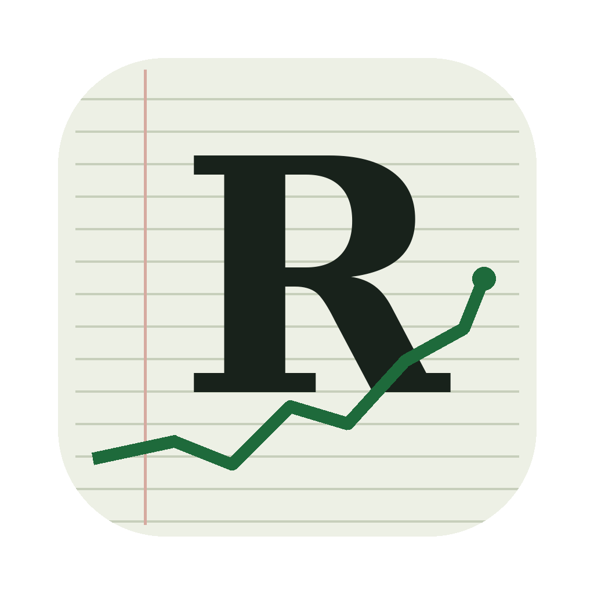

# Le Raider

Simulation boursière inspirée de *Wall Street Raider*. Vous partez avec 25 M€ face à trois raiders concurrents, avec vingt ans (ou trente, ou cinquante) pour bâtir un empire : accumuler des titres, lancer des OPA et des OPE, prendre le contrôle de sociétés, les endetter ou les développer, émettre des actions et des obligations, vous faire élire PDG, créer vos propres sociétés et holdings.



## Jouer

**Dans le navigateur.** Une fois le dépôt publié sur GitHub Pages, le jeu est à l'adresse `https://<votre-compte>.github.io/le-raider/`. Il fonctionne hors ligne après la première visite et sauvegarde la partie automatiquement.

**Dans le Dock du Mac, sans rien installer** (macOS Sonoma ou plus récent) : ouvrez l'adresse ci-dessus dans Safari, puis Fichier > Ajouter au Dock. Le jeu s'ouvre alors dans sa propre fenêtre, comme une application.

**Application Mac.** Téléchargez le `.dmg` depuis l'onglet *Releases* du dépôt et glissez Le Raider dans Applications. L'application n'est pas signée par un compte Apple Developer, donc macOS la bloque au premier lancement :
1. Tentez de l'ouvrir une fois, puis fermez le message.
2. Ouvrez Réglages Système > Confidentialité et sécurité, puis cliquez sur « Ouvrir quand même » en bas de la page.
3. Si macOS affirme que l'application est endommagée, exécutez dans le Terminal : `xattr -cr "/Applications/Le Raider.app"`.

La sauvegarde de l'application Mac est distincte de celle du navigateur.

## Développer

Prérequis : Node.js 20 ou plus récent. Pour l'application de bureau, en plus : [Rust](https://rustup.rs).

```sh
npm install
npm run dev          # http://localhost:5173
npm test             # moteur, parties aléatoires, rendu de l'interface
npm run equilibrage  # banc d'essai de l'équilibre (quelques minutes)
npm run app:dev      # application de bureau en développement
```

L'architecture, les règles implémentées, les repères d'équilibre et les pièges connus sont décrits dans [CLAUDE.md](CLAUDE.md). C'est aussi le fichier que lit Claude Code en ouvrant le dépôt.

## Publier

- **Version web** : chaque push sur `main` lance les tests puis publie `dist/` sur GitHub Pages (workflow `pages.yml`). Réglage à faire une fois : Settings > Pages > Source : *GitHub Actions*.
- **Application Mac** : pousser une étiquette de version compile une application universelle (Apple Silicon et Intel) sur une machine macOS de GitHub, puis la joint à une *Release* (workflow `mac.yml`) :
  ```sh
  git tag v0.1.0
  git push --tags
  ```
  Le workflow se lance aussi à la main depuis l'onglet Actions.
